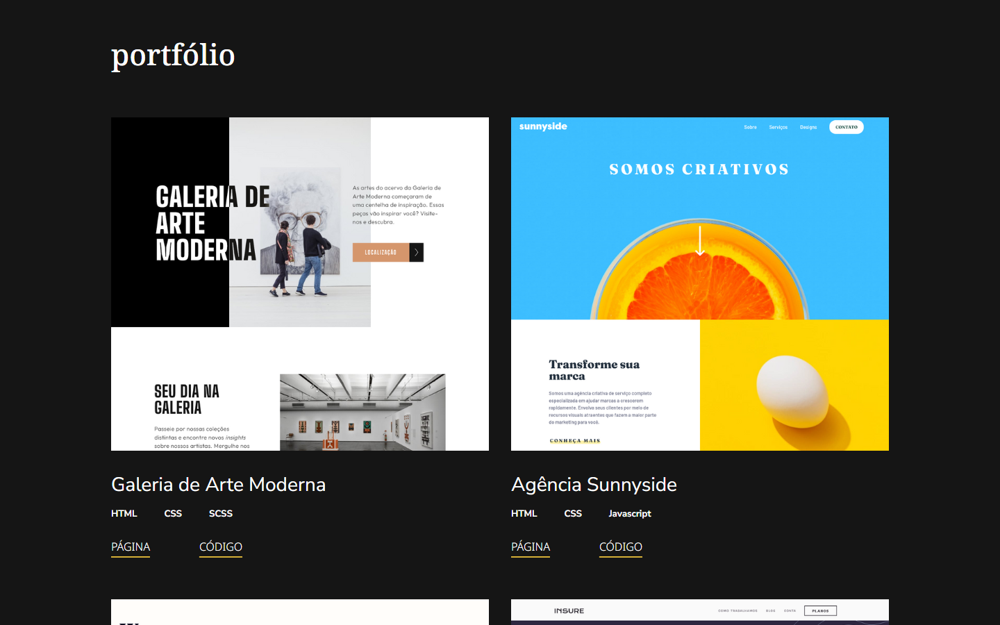

# PORTFÓLIO

Portfólio de Desenvolvedora Frontend com alguns projetos e estudos utilizando HTML5, CSS, SASS, JavaScript e React.

## Conteúdo

- [PORTFÓLIO](#portfólio)
  - [Conteúdo](#conteúdo)
    - [Imagem](#imagem)
    - [GitPage](#gitpage)
    - [Desenvolvido Com](#desenvolvido-com)
    - [Recursos Utilizados](#recursos-utilizados)
  - [Autora](#autora)
  - [Créditos](#créditos)

### Imagem

### GitPage

- Gitpage: [Portfólio de Marcela Costa](https://your-solution-url.com)

### Desenvolvido Com

- HTML5 semântico
- Flexbox
- CSS Grid
- SASS
- Media Queries

### Recursos Utilizados

- [Canva](https://www.canva.com/pt_br/) - 
- [Favicon.ico App Icon Generator](https://www.favicon-generator.org/)

## Autora

- GitHub - [Marcela Costa](https://github.com/MarcelaCostaA)
- CodePen - [Marcela Costa](https://codepen.io/Marcela-Costa)
- Linkedin - [Marcela Costa ]( )
- Behänce - [Marcela Costa](https://www.behance.net/marcelaamorim)

## Créditos

Este portfólio foi baseado no modelo proposto pelo site Frontend Mentor [Single-page developer portfolio challenge on Frontend Mentor](https://www.frontendmentor.io/challenges/singlepage-developer-portfolio-bBVj2ZPi-x). 

